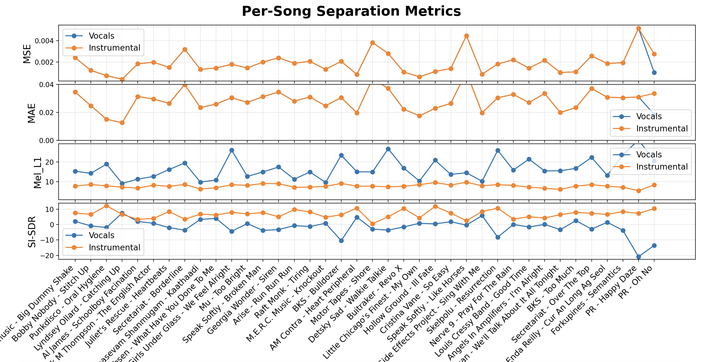

<!-- roadmap: 

gather data (basically done)
convert tracks to spectrograms (script ready, need to debug and run on entire dataset)
write code for unet model (todo)
train model on balanced dataset (todo)
test model (todo)
make web app to host model (todo) -->

README.md (1 point each)
README.md has What it Does section that describes in one paragraph what your project does - Done 
README.md has Quick Start section that concisely explains how to run your project
README.md has Video Links section with direct links to your demo and technical walkthrough videos
README.md has Evaluation section that presents any quantitative results, accuracy metrics, or qualitative outcomes from testing
README.md has Individual Contributions section for group projects that describes who did what - Done 

## Quick Start
(do x and y...)

## Video Links
Demo Video: 
Walkthrough Video: 

## Evaluation
In order to assess the performance of our separation model, we applied it to a subset of the testing split of the MUSDB18 dataset and evaluated the predicted stems against the ground truth. Because MUSDB18 provides vocals, bass, drums, and “other” stems—but does not provide a standalone instrumental stem, we first merged `bass.wav`, `drums.wav`, and `other.wav` using `data/merge-tracks.py` to create a unified `instrumental.wav` target for evaluation.

We then used our `scoring.py` script, which performs inference on each track, caches outputs, and computes four metrics for both the predicted vocals and instrumental stems:

- MSE (Mean Squared Error): Measures sample level reconstruction error

- MAE (Mean Absolute Error): Measures absolute deviation between predicted and true waveforms

- Mel_L1: Measures perceptual distance in mel-spectrogram space (lower is better)

- SI-SDR (Scale-Invariant Signal-to-Distortion Ratio): A standard source separation metric. A higher score indicates cleaner, less contaminated separation

The script computes scores on a per-song basis and then adds them to find the dataset averages. 

> **Vocal Evaluation Averages** 
- MSE       : 0.0018
- MAE       : 0.0283
- Mel_L1    : 16.6695
- SI-SDR    : -1.4661

> **Instrumental Evaluation Averages**
- MSE       : 0.0019
- MAE       : 0.0287
- Mel_L1    : 7.9290
- SI-SDR    : 6.8584

> **Interpretation**

The results we gathered show that instrumental separation is generally easier than vocal isolation. This is especially true for Unet models that are small or have been trained on limited data, like ours. While the instrumental predictions achieve an acceptable fidelity, the vocal stem separation could benefit from more improvements to the architecture or a bigger dataset and an improved loss function optimized for vocal clarity. 

## What It Does 
The goal of this project is to enable the extraction of vocal and instrumental stems from a single audio file. We plan to develop a webpage where users can upload an MP3 and download its isolated vocal and instrumental components. Our approach involves training a U-Net architecture on a custom dataset composed of existing audio collections as well as additional scraped tracks to broaden the model’s exposure and improve performance. This tool could be especially useful for music producers who want to sample vocals for remixes or integrate them into new compositions. This tool is especially useful for vocals to remix, or utilize in a new work.

## Individual Contributions 
Jason and Brandon split evenly the data handling, model training, and model tuning 

# Project Walkthrough

## Data Collection 
An ideal dataset for this project would contain a large quantity of songs each with it's own mixture, vocals, and instrumental tracks. 
We employed the MUSDB18 dataset for this purpose, however we felt that it lacked variety so we resorted to curating our own dataset. The MUSDB18
dataset was still used in our custom data, but we added more tracks through webscrapping for more variation in types of songs. Each track in our dataset contains mixture.wav, vocals.wav, and instrumental.wav. All of these use an industry standard sampling rate of 44.1kHz, which matches the nature of our UNet architecture. After collecting all the data, the next step is to process it to serve our training purposes.

## Preprocessing 
We start our project by preparing audio data for training and evaluation. Since we start using a chunk of MUSDB18, which breaks the song down into `bass.wav`, `drums.wav`,`other.wav`, `vocals.wav`, and `mixture.wav`, we needed to get an instrumental only track. We use the `data/merge-tracks.py` script to combine the instrumental parts into `instrumental.wav`. Then we can move into the second step in our pipeline, preprocessing. We use `preprocessing.py` in the `processing` folder, which, uses a set of functions designed to prepare data for a source-separation model. 
- `load_audio(path, sr)` loads an audio file from disk, converts it into a PyTorch tensor in channel-first format, and resamples it to the target sample rate if needed.

- `stft_mag_phase(waveform)` computes the Short-Time Fourier Transform(STFT) of the input audio and returns its magnitude and phase components.

- `normalize_spectrogram(mag)` normalizes the magnitude spectrogram per frequency bin by computing and applying mean and standard deviation values.

- `denormalize(mag_norm, mean, std)` reverses the normalization to recover the original scale of the spectrogram.

- `compute_ratio_masks(voc_mag, inst_mag)` generates soft ratio masks for vocals and instrumentals by comparing their magnitudes to the combined mixture magnitude.

- `apply_augmentations(waveform)` applies simple data augmentations such as small pitch shifts and frequency masking to increase training diversity.

## Preparing Pytorch Dataset
Even after processing the data, we still need to do more to properly load the data into the UNet model. The `dataset.py` file in the `processing` folder, creates a Pytorch `Dataset` class: `MUSDB2StemDataset` which is designed to load, organize, preprocess, and serve data for a 2-stem source separation model(Vocals vs instrumental). The class normalizes spectrograms and their corresponding ratio masks, while keeping the dataset split, indexing, and loading consistent for both training and evaluation. 

At first, the class scans through the dataset folder and then sorts all the tracks and automatically divides them into train, validation, and test using splits using 70/15/15 ratio. It also stores configuration options like segment length and whether to apply data augmentation. 
- `__getitem__` Normalizes the mixture magnitude spectrogram to stabilize learning. It computes ratio masks for vocals and instrumentals, which act as the training targets for mask-predicting models. It returns a structured dictionary containing normalized mixture features, mean/std statistics, mixture phase, and both target masks.

## UNet Model

The script defines a lightweight U-Net designed to predict four output masks. Those being the left and right channels for vocals, and left and right channels for instrumentals. These predictions come from a stereo magnitude spectrogram inputs. This architecture treats the spectrogram as a 2-channel image, so it learns spatial patterns across both frequency/time space and stereo correlations. 

- Encoder: Downsamples the spectrogram, captures broader context and learns abstract features 
- Bottleneck: forms the most compressed representation, contains high level global information 
- Decoder: upsamples those features, recombines them with early encoder activations through skip connections, restores fine spectral detail
- Final Convolution: 1x1 convolution, maps the decoded representation to four mask channels, corresponding to stereo and stereo instrumentals. 
- Output: Sigmoid ensures the output fall between 0-1 so they behave like multiplicative soft masks.

**This design intentionally uses only two downsampling levels so it can run on low-VRAM GPUs while still modeling stereo structure.**

## Training The Model
This script implements the complete training pipeline for the UNet model defined in `models/unet.py`, using the dataset loaded and processed by the `MUSDB2StemDataset` class in `processing/dataset.py`. All of these files are used to form an end to end system for training a deep learning model to estimate the instrumental masks from mix spectrograms. 

### References to other Modules

1. Using `MUSDB2StemDataset` from `dataset.py` to load training data.
The training script wraps the dataset class into PyTorch DataLoaders, which then provide batching, shuffling, and background loading via `num_workers`

2. Using the stereo UNet from `unet.py` as the model to be trained. The model takes `(B, 2, F, T)`  → stereo spectrogram magnitude and outputs `(B, 2 stems, 2 channels, F, T)`. The output represents the vocal and instrumental masks for the left and right channels. The training script instantiates the Unet model, sends to the GPU, and optimizes its parameters based on the L1 mask regression loss.

### What the script is actually doing

> **Environmental Setup**
- Determines available hardware with `get_device()`
- Adds the repository root to the `sys.path` so imports work when run as a standalone script

> **Configuration via `config` dataclass**

The `Config` class stores all training hyperparameters, which include 
- dataset path
- epochs, batch size, num workers
- optimizer settings (AdamW / Adam / SGD)
- learning rate, weight decay
- gradient clipping
- mixed precision toggle
- early stopping patience 
- checkpoint directory

> **Creating Training + Validation Dataloaders**

`get_dataloaders()` instantiates two `MUSDB2StemDataset` objects which it then wraps in PyTorch Dataloaders with 
- shuffling for training
- batching
- multithreading (if enabled)

each batch contains
- normalized mixture magnitudes 
- vocal and instrumental masks

> **Initializing the Model**

The training script uses `unet.py` to create `UNet(base_channels=8)`. Then the model is moved to the GPU depending on hardware availability. 

> **Optimizer and Scheduler Setup**

Use `get_optimizer()` to build AdamW optimizer, then attaches the ReduceLROnPlateau scheduler that reduces learning rate when validation loss stagnates. This allows adaptive training progress management. 

> **Mixed Precision Support**

if AMP is enabled and CUDA is available, the script uses `torch.amp.GradScaler()`. Which results in faster training + lower VRAM usage. 

> **Training Loop**

We use the `train_one_epoch()` function for training. 
For each batch: 
- Load mixture magnitude and masks
- Build a target tensor stacking vocal + instrumental masks
- Run the UNet forward pass
- Compute L1 loss between predicted masks and target masks
- Backpropagate
- Apply optional gradient clipping
- Update optimizer
- Track loss

> **Validation Loop**

We use the `eval_one_epoch()` function for training. 
For each batch: 
- Model runs in inference mode 
- No gradient updates 
- Computes L1 loss on the val dataset
- Used for early stopping + scheduler adjustments

> **Checkpoint**

After each epoch, if the validation improves then save the best model checkpoint. Always save the last model checkpoint. The checkpoints contain: **model state, optimizer state, training curves, config, and epoch metadata**

> **Early Stopping**

If no validation improvements for `cfg.patience` epochs, training stops.

> **Main Driver**

This is the part of the code that puts everything together
- loads config
- sets device
- builds dataloaders
- builds model
- builds optimizer and scheduler
- runs training/validation epochs
- handles checkpointing + early stopping
- prints final message when complete